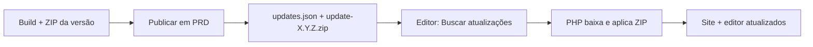

# Atualizações remotas — clientes em domínio próprio

> **Status:** planejamento — não implementado.  
> **Última revisão:** julho/2026.

Documento de especificação para evoluir o produto com **atualização automática de código** nos clientes que rodam **fora** da plataforma (`linksnabio.app.br/{slug}/`), de forma semelhante ao fluxo do **WordPress** (verificar → baixar → aplicar).

---

## Contexto

Hoje existem **dois modelos** de instalação:

| Modelo | Onde roda | Como atualiza o **código** hoje |
|--------|-----------|----------------------------------|
| **Plataforma** | `linksnabio.app.br/{slug}/` | Painel `/panel/` → **Atualizar sites** (copia `_template/` para cada cliente, preservando dados) |
| **Single-tenant** | Domínio do cliente (`igreja.com.br`, etc.) | **Manual** — você faz build local e reenvia por FTP, preservando `bio.json`, `assets/` e `auth.config.php` |

O conteúdo (`bio.json`, imagens) já é editável pelo cliente **sem rebuild**. Este documento trata só de **atualizar o template** (HTML, JS, CSS, PHP do editor) quando o produto evolui.

### Objetivo

Permitir que clientes em **domínio próprio** atualizem o código pelo **editor**, na aba **Configurações**, com um botão **Buscar atualizações** — sem depender de FTP manual.

Clientes na **plataforma** continuam sendo atualizados pelo painel (sem botão no editor).

---

## Resumo da ideia (confirmado)

1. Ao gerar um **build de nova versão**, o pipeline também produz um **ZIP de atualização**.
2. Ao publicar em **produção (PRD)**, esse ZIP (e um manifesto de versão) ficam disponíveis em um endpoint público controlado por nós.
3. No editor do cliente **externo**, em **Configurações**:
   - Exibir **versão instalada** e **data da última atualização**.
   - Botão **Buscar atualizações** → se houver versão mais nova, **baixar o ZIP**, extrair e **substituir arquivos** do template (bio + editor), **sem duplicar** pastas e **sem apagar** dados do cliente.
4. Nos editores da **plataforma**, exibir versão e data também, mas **sem** botão de atualizar (fluxo continua no `/panel/`).

---

## Fluxos comparados

### Plataforma (mantém como está)

```mermaid
flowchart LR
  A[Build platform-release] --> B[Upload FTP / PRD]
  B --> C[_template/ na raiz]
  C --> D[Painel: Atualizar sites]
  D --> E[/{slug}/ de cada cliente]
```

**Preservado por cliente:** `bio.json`, `bio.draft.json`, `assets/`, `auth.config.php`, `bio-path.json`, credenciais de plataforma.

### Cliente em domínio próprio (novo)



**Preservado no cliente:** os mesmos arquivos sensíveis do modelo plataforma (ver § Arquivos preservados).

---

## Versionamento

### Identificador de versão

Usar **SemVer** no manifesto: `MAJOR.MINOR.PATCH` (ex.: `1.4.2`).

| Tipo | Quando incrementar | Impacto no cliente |
|------|-------------------|-------------------|
| **PATCH** | Correções, ajustes de CSS/JS, PHP sem quebra | Atualização automática segura |
| **MINOR** | Novos tipos de card, campos opcionais no JSON | Atualização automática; `bio.json` antigo continua válido |
| **MAJOR** | Mudança incompatível de schema, remoção de tipos | Exigir confirmação explícita ou migração documentada |

A versão deve existir em **um único lugar canônico** no repositório (ex.: `VERSION` na raiz ou campo `version` no `package.json` raiz) e ser **copiada** para os artefatos de build.

### Arquivo de versão no cliente

Após cada atualização bem-sucedida, gravar no servidor (ex.: `editor/update-state.json`):

```json
{
  "version": "1.4.2",
  "updatedAt": "2026-07-09T03:15:00Z",
  "channel": "stable",
  "previousVersion": "1.4.1"
}
```

O editor lê esse arquivo para exibir na aba **Configurações**.

### Manifesto público (servidor de updates)

Hospedado em produção, ex.: `https://linksnabio.app.br/updates/updates.json`:

```json
{
  "latest": "1.4.2",
  "releasedAt": "2026-07-09T02:00:00Z",
  "minPhp": "7.4",
  "changelog": "Correção de imagens em subpasta; melhorias no preview.",
  "packages": {
    "1.4.2": {
      "url": "https://linksnabio.app.br/updates/insta-bio-1.4.2.zip",
      "sha256": "abc123...",
      "size": 1843200
    }
  }
}
```

O editor compara `update-state.json` local com `latest` do manifesto.

---

## Pacote ZIP de atualização

### Conteúdo

O ZIP deve refletir a estrutura de um deploy **single-tenant** (`release/`), **sem** dados do cliente:

```
insta-bio-1.4.2.zip
├── manifest.json          # versão, lista de arquivos, checksums
├── site/                  # bio pública (equivalente a dist/ na raiz)
│   ├── index.html
│   ├── assets/
│   └── …
└── editor/                # editor/dist/ (sem auth.config.php do cliente)
    ├── index.html
    ├── assets/
    ├── login.php
    ├── save.php
    └── …
```

**Não incluir no ZIP:**

- `bio.json`, `bio.draft.json`, `bio.default.json` (opcional: incluir só se quiser atualizar o *modelo* sem sobrescrever — ver decisão abaixo)
- `assets/` do cliente (imagens enviadas)
- `auth.config.php`, `auth.json`
- `bio-path.json` (caminho customizado do cliente)
- `platform-api.json` (clientes da plataforma)
- `update-state.json` (gerado no cliente)

### `manifest.json` dentro do ZIP

```json
{
  "version": "1.4.2",
  "layout": "single-tenant-v1",
  "siteRoot": "site",
  "editorRoot": "editor",
  "preserve": [
    "bio.json",
    "bio.draft.json",
    "bio-path.json",
    "assets/**",
    "editor/auth.config.php",
    "editor/platform-api.json",
    "editor/update-state.json"
  ],
  "files": [
    { "path": "site/index.html", "sha256": "…" },
    { "path": "editor/assets/index-abc123.js", "sha256": "…" }
  ]
}
```

### Aplicação no servidor (sem duplicar)

Regras para o script PHP de update:

1. Baixar ZIP para pasta temporária **fora** do `public_html` se possível (`sys_get_temp_dir()`).
2. Validar **SHA-256** do arquivo contra o manifesto remoto.
3. Extrair em diretório temporário.
4. Validar `manifest.json` interno (versão, layout suportado).
5. **Copiar com substituição** arquivo a arquivo:
   - Conteúdo de `site/` → raiz do site do cliente (`public_html/` ou subpasta configurada).
   - Conteúdo de `editor/` → `public_html/editor/` (ou caminho relativo ao `BIO_JSON_PATH`).
6. **Nunca** criar `editor/editor/` ou `assets/assets/` — sempre mapear para os roots já conhecidos (`editor-paths.php`).
7. Remover arquivos **órfãos** de bundles antigos (ex.: `index-oldhash.js`) conforme lista do manifesto novo — evita lixo e confusão de cache.
8. Atualizar `editor/update-state.json`.
9. Limpar temporários.

### Arquivos preservados (obrigatório)

| Arquivo / pasta | Motivo |
|-----------------|--------|
| `bio.json` | Conteúdo publicado do cliente |
| `bio.draft.json` | Rascunho em edição |
| `bio-path.json` | JSON em subpasta (`painel/bio.json`) |
| `assets/` (e `painel/assets/` etc.) | Mídia do cliente |
| `editor/auth.config.php` | Login e caminhos |
| `editor/platform-api.json` | Só plataforma — não sobrescrever se existir |
| `editor/update-state.json` | Histórico local (reescrito ao final) |

---

## Interface no editor

### Aba Configurações (`AdvancedPanel`)

#### Cliente em domínio próprio (`single-tenant`)

| Elemento | Comportamento |
|----------|---------------|
| **Versão instalada** | Lê `editor/update-state.json` ou fallback `"desconhecida"` |
| **Última atualização** | Data formatada `updatedAt` |
| **Buscar atualizações** | `GET` manifesto → compara versões |
| **Atualizar agora** | Visível só se `latest > installed`; chama API PHP |
| **Changelog** | Texto curto da versão disponível |
| **Estado** | idle / checking / downloading / applying / success / error |

Fluxo sugerido (como WordPress):

1. Usuário clica **Buscar atualizações**.
2. Se não houver versão nova → mensagem “Você está na versão mais recente”.
3. Se houver → mostrar versão, data, changelog e botão **Atualizar agora**.
4. Durante aplicação → barra de progresso ou spinner; **bloquear** novo save/publicar.
5. Ao concluir → “Atualização concluída” + recarregar editor; opcional link “Ver site”.

#### Cliente na plataforma

| Elemento | Comportamento |
|----------|---------------|
| **Versão instalada** | Igual |
| **Última atualização** | Data do último sync via painel (gravada no `update-state.json` pelo PHP do painel) |
| **Buscar atualizações** | **Não exibir** — texto: “Atualizações gerenciadas pela plataforma.” |

Detecção de modo:

- Presença de `editor/platform-api.json` ou flag `PLATFORM_CLIENT` no `auth.config.php` / resposta da API de sessão.

---

## API PHP (cliente externo)

Novos endpoints sob `editor/` (nomes sugeridos):

| Endpoint | Método | Função |
|----------|--------|--------|
| `update-check.php` | GET | Lê manifesto remoto, compara com local, retorna JSON |
| `update-apply.php` | POST | Baixa ZIP, valida, aplica (requer sessão autenticada) |
| `update-status.php` | GET | Retorna `update-state.json` |

**Autenticação:** somente usuário logado no editor (mesma sessão de `login.php`).

**Segurança mínima:**

- HTTPS obrigatório para download do manifesto e ZIP.
- Validar checksum SHA-256.
- Timeout e tamanho máximo do ZIP (ex.: 50 MB).
- Rate limit simples (ex.: 1 apply por 10 minutos).
- Log em arquivo (`editor/update.log`) sem expor ao visitante.

**HostGator:** `ZipArchive` do PHP costuma estar disponível; documentar fallback se `proc_open` / memória limitada em planos muito restritos.

---

## Pipeline de release (desenvolvimento → PRD)

### Build local

Estender o pipeline existente:

```bash
# Hoje
npm run build              # dist/
npm run editor:hostgator   # editor/dist/
make package               # release/

# Novo (planejado)
npm run build:update-package   # → dist/update-packages/insta-bio-{version}.zip
                               #   + updates/updates.json (manifesto)
```

Ou integrar em `make package` com flag `--with-update-zip`.

Passos do script:

1. Ler versão canônica (`VERSION` ou `package.json` raiz).
2. Rodar builds atuais (`bio` + `editor:hostgator`).
3. Montar árvore `site/` + `editor/` dentro de staging.
4. Gerar `manifest.json` com checksums de cada arquivo.
5. Criar ZIP.
6. Atualizar `updates.json` com entrada da nova versão (manter histórico das últimas N versões).

### Deploy em PRD

Ao subir a plataforma (`platform-release/` ou pasta dedicada):

```
public_html/
└── updates/                    # pasta pública só para manifesto + ZIPs
    ├── updates.json
    ├── insta-bio-1.4.1.zip
    └── insta-bio-1.4.2.zip
```

- Servir `updates.json` com `Cache-Control: no-cache` (ou TTL curto).
- ZIPs podem ter cache longo (imutáveis por versão).

**Importante:** clientes externos apontam para **este** endpoint; não precisam estar no mesmo domínio da bio deles.

---

## Primeira instalação vs. atualização

| Momento | Versão |
|---------|--------|
| Deploy inicial (FTP / `make package`) | Gravar `update-state.json` com versão do pacote usado |
| Clientes já no ar antes desta feature | Versão `"0.0.0"` ou inferida do hash do `index.html` até primeira atualização manual |
| Após implementar | Incluir `update-state.json` no `package-deploy.mjs` com versão do build |

---

## Rollback e falhas

| Cenário | Comportamento desejado |
|---------|------------------------|
| Download interrompido | Não alterar arquivos; manter versão anterior |
| ZIP corrompido | Falhar na validação SHA; não aplicar |
| Falha no meio da cópia | **Ideal:** backup automático em `editor/update-backup-{version}/` antes de aplicar; restaurar se erro |
| Site quebrado após update | Você restaura backup por FTP ou implementa botão “Reverter última atualização” (fase 2) |

WordPress mantém backup de plugins/temas — vale copiar o padrão de **backup pré-update** só dos arquivos que serão substituídos (não do `bio.json`).

---

## Testes antes de liberar

Checklist por versão publicada:

- [ ] Cliente com `bio.json` na raiz — update OK, conteúdo intacto
- [ ] Cliente com `painel/bio.json` + `painel/assets/` — imagens OK após update
- [ ] `auth.config.php` preservado — login funciona
- [ ] Rascunho (`bio.draft.json`) preservado
- [ ] Bundles antigos removidos — sem 404 de JS
- [ ] Versão e data corretas na UI
- [ ] Cliente plataforma — só exibe versão, sem botão
- [ ] PHP 7.4 / 8.x na HostGator — ZipArchive e limites de memória

---

## Fases de implementação sugeridas

### Fase 1 — Fundação

- [ ] Arquivo `VERSION` + injeção no build
- [ ] `update-state.json` no `package-deploy.mjs`
- [ ] Script `build:update-package` (ZIP + manifesto interno)
- [ ] Publicar `updates/` em PRD manualmente

### Fase 2 — Editor (UI + leitura)

- [ ] Exibir versão e data em **Configurações** (todos os clientes)
- [ ] `update-check.php` + botão **Buscar atualizações** (só single-tenant)

### Fase 3 — Aplicação automática

- [ ] `update-apply.php` com backup, validação e cópia
- [ ] Remoção de bundles órfãos
- [ ] Mensagens de erro amigáveis

### Fase 4 — Operação

- [ ] Integrar geração do ZIP no fluxo de release
- [ ] Painel grava `updatedAt` no sync de plataforma
- [ ] Documentar em [HOSTGATOR.md](./HOSTGATOR.md) e [COMERCIALIZACAO.md](./COMERCIALIZACAO.md)

### Fase 5 — Opcional

- [ ] Rollback pelo editor
- [ ] Canal `beta` no manifesto
- [ ] Assinatura GPG do ZIP (além de SHA-256)

---

## Decisões em aberto

| # | Pergunta | Opções |
|---|----------|--------|
| 1 | Atualizar `bio.default.json` no cliente? | Não sobrescrever (recomendado) / sobrescrever só se usuário confirmar |
| 2 | URL do manifesto | Fixa em `linksnabio.app.br/updates/` / configurável em `auth.config.php` |
| 3 | Quem pode aplicar update | Qualquer login do editor / só `admin` |
| 4 | Manutenção durante update | Modo manutenção com `maintenance.flag` (fase 2) |
| 5 | Versão mínima para auto-update | Ex.: só clientes `>= 1.0.0` podem pular para `1.4.2` |

---

## Relação com a documentação existente

| Documento | Relação |
|-----------|---------|
| [PLATAFORMA.md](./PLATAFORMA.md) | Sync via painel — **não muda**; pode passar a gravar `update-state.json` |
| [HOSTGATOR.md](./HOSTGATOR.md) | Hoje: update manual por FTP — este doc **substitui** esse fluxo para código |
| [COMERCIALIZACAO.md](./COMERCIALIZACAO.md) | “Atualizar template” deixa de ser só seu trabalho em clientes com auto-update |
| [EDITOR.md](./EDITOR.md) | Incluir seção Configurações → versão e atualizações quando implementado |
| [MELHORIAS.md](./MELHORIAS.md) | Referenciar este arquivo no roadmap |

---

## Referência: analogia WordPress

| WordPress | insta-bio (proposto) |
|-----------|----------------------|
| Painel → Atualizações | Editor → Configurações → Buscar atualizações |
| `wp-admin/update-core.php` | `editor/update-apply.php` |
| Pacote de plugin/tema (.zip) | `insta-bio-{version}.zip` |
| Não apaga `wp-content/uploads` | Não apaga `bio.json` / `assets/` |
| Versão em `wp-includes/version.php` | `editor/update-state.json` |
| Updates em `api.wordpress.org` | `linksnabio.app.br/updates/updates.json` |

---

## Resumo executivo

**Sim, deu para entender.** A proposta separa bem os dois mundos:

- **Dentro da plataforma** → você continua atualizando pelo `/panel/`, com versão visível no editor.
- **Fora da plataforma** → o cliente (ou você, logado no editor dele) dispara a atualização estilo WordPress, a partir de um ZIP versionado publicado em PRD junto com cada release.

O ponto crítico de engenharia é **aplicar o ZIP sem duplicar pastas** e **nunca sobrescrever** `bio.json`, `assets/` e `auth.config.php` — o mesmo contrato que o sync do painel já respeita hoje.
