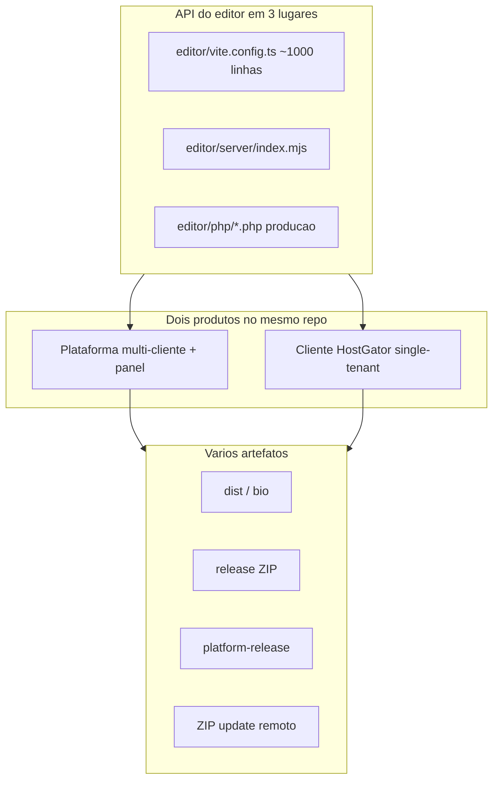

# Plano: simplificar o monorepo insta-bio

Documento salvo em **06/08/2026** para execução posterior.  
Origem: planejamento no Cursor (simplificar monorepo).

**Status:** pendente — não iniciado.

---

## Overview

Mapa priorizado para reduzir a carga cognitiva do monorepo **sem reescrever o produto**: esclarecer os dois modos de operação, enxugar comandos/docs, e eliminar a API do editor triplicada (Vite / Node / PHP).

---

## Checklist (todos)

- [ ] **Fase 0** — Criar `docs/COMO-FUNCIONA.md` + links no Makefile/PROJETO; deprecar aliases admin/demo
- [ ] **Fase 1** — Vite proxy → `editor/server`; remover `/api/bio/*` duplicado do `vite.config.ts`; checklist endpoint = PHP + Node
- [ ] **Fase 2** — Makefile com 3 verbos oficiais; enxugar scripts de package; cache do `ensure-dev-builds`
- [ ] **Fase 3** — Limpar pastas/docs legadas e duplicações bad-code; UX editor só depois

---

## Por que parece complexo

Não é a bio em si (`bio.json` → cards). É o monorepo operando **dois produtos** com **três runtimes** da mesma API:

| Fonte de complexidade | Impacto |
|----------------------|---------|
| API do editor espelhada 3x (Vite middleware + `server/` + `php/`) | Alto — todo endpoint novo (ex.: backup) precisa de 3 implementações |
| Pipelines `build:template` / `build:core` / `build:platform` / `build:update-package` / `ensure:dev-builds` | Alto — `make dev-all` rebuilda template e quebra fácil |
| Docs fragmentadas (~15 arquivos + `docs/docs_claude/` + `bad-code/`) sem um índice único de “como o sistema roda” | Médio-alto |
| Aliases (`admin`/`demo`/`editor`) e pastas (`admin/`, `platform-template/`, `deploy/`) | Médio |
| Superfície do editor (muitos tipos de card/campos) | Médio para o **cliente**; secundário para a dor de “como o projeto funciona” |

**Fora de escopo deste plano:** reescrever a bio, matar o panel, ou migrar HostGator para Node. O ganho é **entendimento e manutenção**, não feature nova.

---

## Fase 0 — Mapa mental oficial (1–2 dias, zero risco)

Objetivo: uma página que responda “o que é o quê” sem caçar 5 docs.

1. Criar [`docs/COMO-FUNCIONA.md`](COMO-FUNCIONA.md) curto (1 tela mental):
   - Bio pública = `bio/` + `bio.json`
   - Editor do cliente = `editor/` (React) + `editor/php/` (produção)
   - Plataforma = `panel/` + cópias de `_template/` por slug
   - Landing = `site/`
   - Comandos do dia: `make install`, `make dev-all`, `make platform-core`, `make update-package`
2. No topo de [`docs/PROJETO.md`](PROJETO.md) e `Makefile` `help`: link para esse doc; marcar docs longas de update remoto como “só quando for publicar update”.
3. Deprecar aliases no `package.json` raiz (`admin*`, `demo`) com comentário no Makefile — um nome só: `editor`.
4. Corrigir drift de docs: HOSTGATOR/PROJETO ainda citam `make package` (não existe); apontar para `npm run build:package` ou adicionar alias no Makefile.
5. README/PROJETO: só 4–5 docs “vivos”; `docs/docs_claude/` e remodelagens viram arquivo, não mapa da arquitetura.

**Critério de pronto:** conseguir explicar o repo em 60 segundos com esse doc aberto.

---

## Fase 1 — Um caminho de API do editor (maior ROI técnico)

Hoje qualquer mudança (publish, backup, revert) toca:
- `editor/vite.config.ts` (dev)
- `editor/server/index.mjs` (serve local do dist)
- `editor/php/*.php` (produção)

**Abordagem escolhida:** em dev local, o Vite **proxy** para um único backend Node, em vez de reimplementar rotas no middleware.

Passos concretos:

1. Extrair helpers compartilhados de storage (já concentrados em `editor/php/bio-storage.php`) — produção continua PHP.
2. No Vite: remover handlers `/api/bio/*` do middleware e apontar `server.proxy` para `editor/server`.
3. Decisão fechada: **proxy Vite → `editor/server` (Node)** em dev; PHP só no pacote HostGator. Motivo: Node no dia a dia; evita exigir `php` local. Produção permanece PHP.
4. Checklist: cada endpoint em `editor/php/.htaccess` tem **exatamente um** espelho em `editor/server` (não no vite).
5. Encolher `vite.config.ts` (hoje ~1000 linhas) para alias, static e proxy.

**Critério de pronto:** publicar / backup / revert mudam em **um** arquivo Node + **um** PHP — nunca três.

---

## Fase 2 — Enxugar empacotamento e `dev-all`

1. Documentar (e no Makefile deixar explícito) **dois** artefatos oficiais só:
   - `make platform-core` → sobe plataforma (`platform-release/`)
   - `make update-package` → ZIP de update dos clientes
2. Tratar `build:template` / `ensure:dev-builds` como detalhe interno do `dev-all`, não como comandos que você precisa lembrar.
3. Avaliar cache: só rebuildar template se `bio/` ou `editor/` mudaram (já parcialmente em `scripts/ensure-dev-builds.mjs`) — reduzir falhas tipo o `tsc` do editor bloqueando `make dev-all`.
4. Arquivar ou fundir scripts mortos em `scripts/` (se houver sobreposição `package-deploy` vs `package-core`).

**Critério de pronto:** fluxo mental = “dev local / subir plataforma / update clientes” — três verbos.

---

## Fase 3 — Limpeza de superfície (depois das fases 0–2)

Só quando a operação estiver clara:

1. Pastas legadas (`admin/` se for resto de build antigo; docs obsoletas em `docs/docs_claude/` se já aplicadas).
2. Unificar duplicações já listadas em [`docs/bad-code/`](bad-code/) (gate, bio-path, bundles PHP) — uma fonte versionada + check no CI.
3. Extrair `require_editor_session()` nos ~8 endpoints PHP (boilerplate de auth repetido) — baixo risco, leitura bem melhor.
4. UX do editor (agrupar tipos de card “avançados”, defaults mais fortes) — **produto**, não “como o projeto funciona”.

---

## Ordem e o que não fazer agora

| Ordem | Fase | Esforço | Risco |
|-------|------|---------|-------|
| 1 | 0 — doc + comandos | Baixo | Nenhum |
| 2 | 1 — API única em dev | Médio | Médio (regressão em rotas) |
| 3 | 2 — pipelines | Médio-baixo | Baixo |
| 4 | 3 — limpeza/UX | Contínuo | Baixo |

**Não fazer agora:** monorepo Turborepo/Nx; trocar HostGator por Vercel; fundir `bio/`+`editor/` num app só; apagar o panel.

---

## Primeiro entregável recomendado

Começar e **terminar a Fase 0** (doc + Makefile). Em seguida a Fase 1 (proxy Vite → server, cortar middleware duplicado) — é o que mais reduz a sensação de “tudo está espalhado”.

---

## Referências úteis

- [`docs/PROJETO.md`](PROJETO.md)
- [`docs/PLATAFORMA.md`](PLATAFORMA.md)
- [`docs/HOSTGATOR.md`](HOSTGATOR.md)
- [`docs/DEPLOY-ATUALIZACAO.md`](DEPLOY-ATUALIZACAO.md)
- [`docs/bad-code/2026-07-31/`](bad-code/2026-07-31/) — duplicações já auditadas
