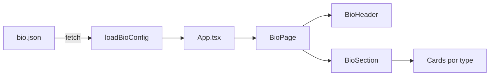

# Documentação do projeto — insta-bio

Template de **link da bio** para Instagram, inspirado no layout da [Igreja Voe](https://voeconnect.com.br/bio). O conteúdo da página é controlado por um arquivo JSON externo, permitindo atualizações sem rebuild.

---

## Visão geral

```
Usuário abre a página
        ↓
App.tsx carrega bio.json via fetch
        ↓
BioPage renderiza header + seções + rodapé
        ↓
Cada card é um componente React baseado no "type" do JSON
```

**Stack:** React 19 · TypeScript · Vite 6 · Tailwind CSS 4 · Lucide Icons

---

## Marca e domínio

> Decisão registrada em julho/2026. O nome do repositório (`insta-bio`) permanece técnico; a marca comercial em formação é **Links na Bio** / **linksnabio**.

### Domínio principal (recomendado)

| Item | Valor |
|------|--------|
| **Marca** | Links na Bio |
| **Slug / escrita** | `linksnabio` (“links na bio”) |
| **Domínio principal** | **`linksnabio.app.br`** |
| **Por quê** | Extensão `.app.br` combina com produto (app de link na bio), custo baixo (~R$ 40/ano), credibilidade no Brasil |

### Reserva opcional

| Domínio | Uso sugerido |
|---------|----------------|
| `linksnabio.net` | Redirecionar para o `.app.br` |
| `linksnabio.site` | Alternativa barata se `.net` não estiver disponível |

### Alternativas avaliadas e descartadas

| Nome | Motivo |
|------|--------|
| `instabio.com.br` | Já em uso |
| `minha.bio`, `bio.co`, `bio.me` | Indisponíveis ou premium |
| `linkdabio.com` | Registrado; concorrente ativo em [linkda.bio](https://linkda.bio/) |
| `linknabio.co`, `linkna.bio` | Concorrentes no mesmo nicho |
| `linxnabio.com` | Boa opção (diferenciação com “x”), mas `.app.br` priorizado para BR |
| `links-na-bio.com` | Hífen prejudica fala, digitação e SEO |
| `linksnabio.tech`, `linksnabio.info` | Caros; extensão não agrega para o público-alvo |

### Próximos passos (marca)

- [ ] Registrar `linksnabio.app.br` no [Registro.br](https://registro.br)
- [ ] Registrar `linksnabio.net` ou `.site` como reserva (opcional)
- [ ] Apontar DNS para a hospedagem (HostGator ou similar)
- [ ] Ativar SSL/HTTPS
- [ ] Atualizar landing, editor e materiais com a nova marca (quando o domínio estiver ativo)
- [ ] Avaliar redirecionamento de typos (`linknabio`, `linkdabio`) se registrar variações

---

## Estrutura de pastas

```
insta-bio/
├── public/                    # Arquivos estáticos (copiados para dist/ no build)
│   ├── bio.json               # ★ Configuração da página (ativa)
│   ├── bio.default.json       # ★ Modelo padrão (comercial / novo cliente)
│   ├── assets/                # Imagens (logo, fotos dos cards…)
│   ├── favicon.svg
│   └── icons.svg
│
├── src/
│   ├── App.tsx                # Ponto de entrada: carrega JSON e exibe loading/erro
│   ├── main.tsx               # Bootstrap do React
│   ├── index.css              # Estilos globais, tema e animações
│   │
│   ├── components/            # Componentes visuais
│   │   ├── BioPage.tsx        # Layout principal da página
│   │   ├── BioHeader.tsx      # Logo, nome, Instagram, capa opcional
│   │   ├── BioSection.tsx     # Renderiza seção + escolhe layout (stack/grid)
│   │   ├── WhatsAppHeroCard.tsx
│   │   ├── FeatureCard.tsx
│   │   ├── LinkCard.tsx
│   │   ├── GridCard.tsx
│   │   ├── LocationCard.tsx
│   │   └── icons.tsx          # Mapeamento de ícones Lucide + SVGs custom
│   │
│   ├── lib/
│   │   ├── loadBioConfig.ts   # Fetch de /bio.json
│   │   └── cn.ts              # Utilitário para classes CSS (clsx)
│   │
│   └── types/
│       └── bio.ts             # Tipos TypeScript do schema do JSON
│
├── docs/
│   ├── BIO-JSON.md            # Referência completa do bio.json
│   ├── PROJETO.md             # Este arquivo
│   ├── PLATAFORMA.md          # Super-admin e multi-cliente
│   ├── ADMIN.md               # Editor visual
│   ├── HOSTGATOR.md           # Deploy na HostGator
│   └── COMERCIALIZACAO.md     # Instalar e vender para clientes
│
├── admin/                     # Editor visual + PHP (produção)
│   ├── src/                   # React
│   ├── php/                   # Login, salvar, upload (HostGator)
│   ├── server/                # Backend Node (só dev)
│   └── dist/                  # Build do editor
│
├── site/                      # Landing comercial (vendas)
│   ├── src/                   # React — inspirada em instabio.cc
│   └── dist/                  # Build da landing
│
├── dist/                      # Saída do build do site (gerado)
├── index.html                 # HTML base + meta tags + fontes
├── vite.config.ts             # Vite + plugin React + Tailwind
├── package.json
└── tsconfig.*.json
```

---

## Arquivos principais

### `public/bio.json`

**O que edita no dia a dia.** Contém marca, seções, links, textos e referências a imagens.

→ Ver [BIO-JSON.md](./BIO-JSON.md) para referência completa.

### `src/App.tsx`

Responsabilidades:
- Buscar `bio.json` ao montar a página
- Exibir spinner de carregamento
- Exibir mensagem de erro se o JSON falhar
- Passar os dados para `<BioPage />`

### `src/lib/loadBioConfig.ts`

Faz `fetch('/bio.json', { cache: 'no-store' })` e retorna o objeto tipado como `BioConfig`.

Para apontar outro arquivo (ex.: `bio-homolog.json`), altere a constante `CONFIG_PATH` aqui — isso **exige rebuild**.

### `src/types/bio.ts`

Define a estrutura esperada do JSON. Serve como documentação viva para desenvolvedores. Se adicionar campos novos no JSON, atualize este arquivo e o componente correspondente.

### `src/components/BioPage.tsx`

- Aplica título e meta description do `brand.seo`
- Renderiza o brilho de fundo (`theme.glow`)
- Monta `<BioHeader />`, lista de `<BioSectionBlock />` e rodapé

### `src/components/BioSection.tsx`

- Lê `section.layout` para decidir entre empilhado (`stack`) ou grade (`grid-2`)
- Faz o `switch` no `item.type` e escolhe o componente de card
- Tipos **não** tratados no switch são silenciosamente ignorados

### Componentes de card

| Arquivo | `type` no JSON | Descrição |
|---------|----------------|-----------|
| `WhatsAppHeroCard.tsx` | `whatsapp-hero` | Card verde animado do WhatsApp |
| `FeatureCard.tsx` | `feature` | Card com variantes: gradient, square, compact, portrait, banner |
| `LinkCard.tsx` | `link` | Linha com ícone + título + subtítulo |
| `GridCard.tsx` | `grid` | Legado — preferir `feature` + `variant: square` |
| `LocationCard.tsx` | `location` | Endereço + link para mapa |

### `src/index.css`

- Importa Tailwind CSS 4
- Define variáveis de tema (`--color-background`, `--color-primary`…)
- Animações: `bio-pulse`, `bio-glow`, `fade-up`

### `index.html`

HTML estático com meta viewport, fonte Inter (Google Fonts) e placeholder de description (sobrescrito pelo React após carregar o JSON).

---

## Fluxo de dados



---

## Comandos

| Comando | O que faz |
|---------|-----------|
| `npm run dev` | Servidor local em `http://localhost:5173` |
| `npm run build` | Gera pasta `dist/` para deploy |
| `npm run preview` | Serve a pasta `dist/` localmente para testar o build |
| `npm run lint` | Verifica código com Oxlint |
| `npm run admin` | Editor local em `http://localhost:5180` |
| `npm run admin:hostgator` | Build do editor + PHP para HostGator |

### Desenvolvimento local

```bash
npm install
npm run dev
```

Edite `public/bio.json` e recarregue o navegador para ver mudanças.

### Deploy

**HostGator (recomendado para comercialização):** ver [HOSTGATOR.md](./HOSTGATOR.md)

```bash
npm run build
npm run admin:hostgator
# Upload dist/ → public_html/
# Upload admin/dist/ → public_html/editor/
```

**Hospedagem estática** (só o site, sem editor online):

```bash
npm run build
```

Publique o conteúdo de `dist/` em Vercel, Netlify, Cloudflare Pages, nginx, etc.

Após o deploy, para atualizar **só conteúdo**, use o editor online ou substitua `bio.json` e arquivos em `assets/` — sem novo build.

---

## Como adicionar um novo tipo de card

1. Defina o tipo em `src/types/bio.ts`
2. Crie o componente em `src/components/`
3. Adicione o `case` em `BioSection.tsx` → `renderItem()`
4. Documente em `docs/BIO-JSON.md`
5. Rebuild e deploy

---

## Como adicionar um novo ícone

1. Importe o ícone do `lucide-react` em `src/components/icons.tsx`
2. Adicione ao objeto `icons` com uma chave (ex.: `music`)
3. Adicione a chave em `IconName` em `src/types/bio.ts`
4. Documente em `docs/BIO-JSON.md`
5. Rebuild e deploy

---

## Personalização visual (código)

| O que mudar | Onde |
|-------------|------|
| Cores do tema padrão | `src/index.css` (`@theme`) |
| Cores por cliente | `bio.json` → `brand.theme` |
| Animações | `src/index.css` + componentes individuais |
| Layout máximo da página | `BioPage.tsx` (`max-w-md`, `max-w-lg`) |
| Fonte | `index.html` (Google Fonts) + `src/index.css` |

---

## Hospedagem

| Cenário | Documento |
|---------|-----------|
| HostGator compartilhada (site + editor) | [HOSTGATOR.md](./HOSTGATOR.md) |
| Vender / instalar para clientes | [COMERCIALIZACAO.md](./COMERCIALIZACAO.md) |
| Só site estático | Vercel, Netlify, Cloudflare Pages, nginx |

Para este projeto, a página é uma única rota `/` — não precisa de fallback SPA especial.

---

## Manutenção futura — checklist

### Atualização de conteúdo (sem dev)

- [ ] Editar `bio.json`
- [ ] Validar JSON
- [ ] Upload no servidor
- [ ] Testar no celular (tamanho real do link da bio)

### Atualização de código

- [ ] Alterar componentes/types
- [ ] `npm run build` local
- [ ] Testar com `npm run preview`
- [ ] Deploy da pasta `dist/`

### Novo cliente / igreja

Ver checklist completo em [COMERCIALIZACAO.md](./COMERCIALIZACAO.md).

- [ ] Montar `bio.json` + imagens no editor
- [ ] `npm run build` + `npm run admin:hostgator`
- [ ] Deploy na HostGator com login único
- [ ] Entregar URLs e credenciais ao cliente

---

## Referências externas

- Layout de inspiração: [voeconnect.com.br/bio](https://voeconnect.com.br/bio)
- Dados iniciais da Igreja Expressar: portal Pipefy (links importados para o `bio.json`)

---

## Documentos relacionados

- [BIO-JSON.md](./BIO-JSON.md) — referência completa do arquivo de configuração
- [ADMIN.md](./ADMIN.md) — editor visual
- [HOSTGATOR.md](./HOSTGATOR.md) — deploy na HostGator
- [COMERCIALIZACAO.md](./COMERCIALIZACAO.md) — comercialização e novos clientes
