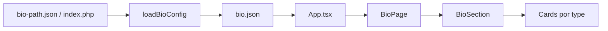

# Documentação do projeto — insta-bio

Template de **link da bio** para Instagram, inspirado no layout da [Igreja Voe](https://voeconnect.com.br/bio). O conteúdo da página é controlado por um arquivo JSON externo, permitindo atualizações sem rebuild.

---

## Visão geral

```
Usuário abre a página
        ↓
App.tsx carrega bio.json via fetch
        ↓
BioPage renderiza header + seções + rodapé
        ↓
Cada card é um componente React baseado no "type" do JSON
```

**Stack:** React 19 · TypeScript · Vite 6 · Tailwind CSS 4 · Lucide Icons

---

## Marca e domínio

> Decisão registrada em julho/2026. O nome do repositório (`insta-bio`) permanece técnico; a marca comercial em formação é **Links na Bio** / **linksnabio**.

### Domínio principal (recomendado)

| Item | Valor |
|------|--------|
| **Marca** | Links na Bio |
| **Slug / escrita** | `linksnabio` (“links na bio”) |
| **Domínio principal** | **`linksnabio.app.br`** |
| **Por quê** | Extensão `.app.br` combina com produto (app de link na bio), custo baixo (~R$ 40/ano), credibilidade no Brasil |

### Reserva opcional

| Domínio | Uso sugerido |
|---------|----------------|
| `linksnabio.net` | Redirecionar para o `.app.br` |
| `linksnabio.site` | Alternativa barata se `.net` não estiver disponível |

### Alternativas avaliadas e descartadas

| Nome | Motivo |
|------|--------|
| `instabio.com.br` | Já em uso |
| `minha.bio`, `bio.co`, `bio.me` | Indisponíveis ou premium |
| `linkdabio.com` | Registrado; concorrente ativo em [linkda.bio](https://linkda.bio/) |
| `linknabio.co`, `linkna.bio` | Concorrentes no mesmo nicho |
| `linxnabio.com` | Boa opção (diferenciação com “x”), mas `.app.br` priorizado para BR |
| `links-na-bio.com` | Hífen prejudica fala, digitação e SEO |
| `linksnabio.tech`, `linksnabio.info` | Caros; extensão não agrega para o público-alvo |

### Próximos passos (marca)

- [ ] Registrar `linksnabio.app.br` no [Registro.br](https://registro.br)
- [ ] Registrar `linksnabio.net` ou `.site` como reserva (opcional)
- [ ] Apontar DNS para a hospedagem (HostGator ou similar)
- [ ] Ativar SSL/HTTPS
- [ ] Atualizar landing, editor e materiais com a nova marca (quando o domínio estiver ativo)
- [ ] Avaliar redirecionamento de typos (`linknabio`, `linkdabio`) se registrar variações

---

## Estrutura de pastas

```
insta-bio/
├── bio/                       # Bio pública (React + conteúdo)
│   ├── public/                # Arquivos estáticos (copiados para dist/ no build)
│   │   ├── bio.json           # ★ Configuração da página (ativa)
│   │   ├── bio.default.json   # ★ Modelo padrão (comercial / novo cliente)
│   │   └── assets/            # Imagens (logo, fotos dos cards…)
│   ├── src/
│   │   ├── App.tsx            # Ponto de entrada: carrega JSON e exibe loading/erro
│   │   ├── components/        # BioPage, cards, header…
│   │   ├── lib/               # loadBioConfig, publicUrl…
│   │   └── types/bio.ts       # Tipos TypeScript do schema do JSON
│   ├── index.html
│   ├── vite.config.ts
│   └── package.json
│
├── docs/
│   ├── BIO-JSON.md
│   ├── PROJETO.md
│   ├── PLATAFORMA.md
│   ├── EDITOR.md
│   ├── HOSTGATOR.md
│   ├── COMERCIALIZACAO.md
│   └── MELHORIAS.md
│
├── editor/                    # Editor visual + PHP (produção)
│   ├── src/
│   ├── php/
│   ├── server/
│   └── dist/
│
├── site/                      # Landing comercial (vendas)
│   └── …
│
├── panel/                     # Super-admin multi-cliente
│   └── …
│
└── dist/                      # Saída do build da bio (gerado na raiz)
```

---

## Arquivos principais

### `bio/public/bio.json`

**O que edita no dia a dia.** Contém marca, seções, links, textos e referências a imagens.

Em desenvolvimento local fica em `bio/public/bio.json`. No servidor, após o build, fica na raiz do site (`public_html/bio.json`) ou em subpasta configurada no editor.

→ Ver [BIO-JSON.md](./BIO-JSON.md) para referência completa.

### `bio/public/bio.default.json`

Modelo comercial usado pelo editor em **Restaurar modelo padrão** e como base para novos clientes.

### `bio/src/App.tsx`

- Busca a configuração ao montar (`loadBioConfig`)
- Exibe spinner de carregamento ou mensagem de erro
- Passa os dados para `<BioPage />`

### `bio/src/lib/loadBioConfig.ts`

Resolve **onde** está o `bio.json` e faz o fetch:

1. `window.__BIO_JSON_PATH__` (injetado pelo `index.php` do cliente)
2. `bio-path.json` na raiz do site
3. `bio-json.php` (proxy PHP que lê `editor/auth.config.php`)
4. Fallback: `bio.json` na raiz

Também define o prefixo de assets (`painel/assets/` quando o JSON está em subpasta).

### `bio/src/lib/publicUrl.ts`

Monta URLs de imagens/vídeos e do `bio.json` conforme a pasta de deploy (raiz, subpasta ou plataforma `/{slug}/`).

### `bio/src/types/bio.ts`

Schema TypeScript do JSON. Atualize ao adicionar campos ou tipos de card.

### `bio/src/components/BioPage.tsx`

- Meta tags (`pageMeta`)
- Fundo, header, seções e rodapé

### `bio/src/components/BioSection.tsx`

- Layout `stack` ou `grid-2`
- `switch` em `item.type` → componente de card

### Componentes de card (principais)

| Arquivo | `type` | Descrição |
|---------|--------|-----------|
| `WhatsAppHeroCard.tsx` | `whatsapp-hero` | Card verde do WhatsApp |
| `FeatureCard.tsx` | `feature` | Variantes gradient, square, compact, portrait, banner |
| `LinkCard.tsx` | `link` | Linha com ícone + título |
| `VideoCard.tsx` | `video` | Vídeo com mute estilo Reels |
| `ProductsCard.tsx` | `products` | Grade de produtos |
| `SlideCard.tsx` | `slides` | Carrossel de imagens/vídeos |
| `SpotifyEmbedCard.tsx` | `spotify` | Player Spotify |
| `YoutubeEmbedCard.tsx` | `youtube` | Embed YouTube |
| `GridCard.tsx` | `grid` | Legado — preferir `feature` + `square` |
| `LocationCard.tsx` | `location` | Endereço + mapa |

### `editor/`

Editor React + API PHP (produção) ou Node (dev). Importa componentes da bio via alias `@site` → `bio/src/`.

Arquivos PHP relevantes: `save.php`, `publish.php`, `upload.php`, `editor-paths.php`, `bio-path.php`, `platform-auth.php`.

---

## Fluxo de dados (bio pública)



---

## Comandos

| Comando | O que faz |
|---------|-----------|
| `npm run dev` | Bio em `http://localhost:5173` |
| `npm run build` | Gera `dist/` na raiz |
| `npm run preview` | Serve `dist/` localmente |
| `npm run lint` | Oxlint em `bio/` |
| `npm run editor` | Editor em `http://localhost:5180` |
| `npm run editor:hostgator` | Build editor + PHP |
| `make dev-all` | Bio + editor + panel + site |
| `make package` | `release/` (bio + editor) |
| `npm run build:platform` | `platform-release/` |

### Desenvolvimento local

```bash
make install
npm run dev          # bio
npm run editor       # editor (outro terminal)
```

Edite `bio/public/bio.json` e use **Publicar** no editor, ou recarregue após salvar o JSON manualmente.

### Deploy single-tenant

Ver [HOSTGATOR.md](./HOSTGATOR.md).

```bash
make package
# ou: npm run build && npm run editor:hostgator
```

### Deploy plataforma multi-cliente

Ver [PLATAFORMA.md](./PLATAFORMA.md).

```bash
npm run build:platform
```

---

## Como adicionar um novo tipo de card

1. Defina o tipo em `bio/src/types/bio.ts`
2. Crie o componente em `bio/src/components/`
3. Adicione o `case` em `BioSection.tsx`
4. Adicione o editor em `editor/src/components/ItemEditor.tsx` (e campos auxiliares)
5. Documente em `docs/BIO-JSON.md`
6. Rebuild e deploy

---

## Como adicionar um novo ícone

1. Importe em `bio/src/components/icons.tsx`
2. Adicione a chave em `IconName` em `bio/src/types/bio.ts`
3. Documente em `docs/BIO-JSON.md`

---

## Personalização visual (código)

| O que mudar | Onde |
|-------------|------|
| Cores do tema padrão | `bio/src/index.css` (`@theme`) |
| Cores por cliente | `bio.json` → `brand.theme` |
| Layout máximo | `BioPage.tsx` |
| Fonte | `bio/index.html` + `bio/src/index.css` |

---

## Hospedagem

| Cenário | Documento |
|---------|-----------|
| HostGator (1 cliente) | [HOSTGATOR.md](./HOSTGATOR.md) |
| Vender / instalar | [COMERCIALIZACAO.md](./COMERCIALIZACAO.md) |
| Plataforma `/{slug}/` | [PLATAFORMA.md](./PLATAFORMA.md) |
| Só site estático | Vercel, Netlify, etc. — publique `dist/` |

---

## Manutenção — checklist

### Conteúdo (sem dev)

- [ ] Editar via editor ou `bio.json`
- [ ] Testar no celular

### Código

- [ ] Alterar em `bio/` e/ou `editor/`
- [ ] `npm run build` + `npm run editor:hostgator`
- [ ] Deploy preservando `bio.json`, `assets/` e `auth.config.php` do cliente

### Novo cliente

Ver [COMERCIALIZACAO.md](./COMERCIALIZACAO.md).

---

## Documentos relacionados

- [BIO-JSON.md](./BIO-JSON.md) — referência do `bio.json`
- [EDITOR.md](./EDITOR.md) — editor visual
- [HOSTGATOR.md](./HOSTGATOR.md) — deploy HostGator
- [COMERCIALIZACAO.md](./COMERCIALIZACAO.md) — comercialização
- [PLATAFORMA.md](./PLATAFORMA.md) — multi-cliente
